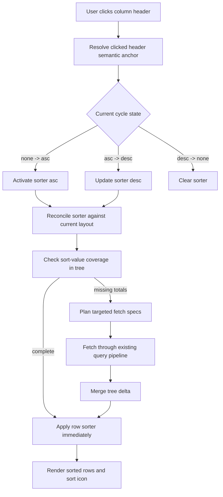

<!--
Licensed to the Apache Software Foundation (ASF) under one
or more contributor license agreements.  See the NOTICE file
distributed with this work for additional information
regarding copyright ownership.  The ASF licenses this file
to you under the Apache License, Version 2.0 (the
"License"); you may not use this file except in compliance
with the License.  You may obtain a copy of the License at

  http://www.apache.org/licenses/LICENSE-2.0

Unless required by applicable law or agreed to in writing,
software distributed under the License is distributed on an
"AS IS" BASIS, WITHOUT WARRANTIES OR CONDITIONS OF ANY
KIND, either express or implied.  See the License for the
specific language governing permissions and limitations
under the License.
-->

# Pivot Table v3 Column UI Sorting Prototype

## 1. Scope

This document specifies a new feature:

- Sorting is triggered from column headers in the rendered pivot table.
- Sorting reorders row hierarchy nodes in the UI.
- Sorting works in both regular and interactive modes.
- Sorting is hierarchical (applies at every row depth).
- Sorting is single-active (only one active sorter at a time).

Primary code references used for this spec:

- `src/PivotTableChart.tsx`
- `src/pivot/render/PivotTableView.tsx`
- `src/pivot/chart/usePivotRenderModel.ts`
- `src/pivot/layout/shouldFetchForLayoutChange.ts`
- `src/pivot/query/specs.ts`
- `src/pivot/query/resolveFetchContext.ts`
- `src/fetchPivotBranch.ts`
- `src/pivot/expansion/useExpansionEngine.ts`
- `src/types.ts`
- `src/utils.ts`
- `test/plugin/PivotTableChart/sorting.test.tsx`
- `test/plugin/query/queryShape.test.ts`
- `test/plugin/controls/PivotDndColumnSelect.test.tsx`

## 2. Required UX Behavior

### 2.1 Interaction model

1. Sorting can only be initiated from column headers.
2. Clicking a sortable column cycles:
   1. Ascending
   2. Descending
   3. None (remove sort and restore base row sort behavior)
3. Sort direction icon is rendered in the header control slot (same slot family as expand/collapse icon), not near the label text.
4. If a different column is clicked, previous sorter is removed and new one becomes active.

### 2.2 Sorting semantics

1. Sorting applies to all row hierarchy levels:
   1. Sort level-1 siblings.
   2. Within each level-1 node, sort level-2 siblings.
   3. Continue recursively for deeper levels.
2. There is no per-level sort toggle; it is one global row-ordering policy.
3. Active column UI sort supersedes row sorter (`rowOrder`/existing dimension row sorting).
4. When UI sort is cleared, row ordering returns to regular sorter configuration.

### 2.3 Sort source and totals rules

1. Any visible column depth can be used as sort anchor.
2. Sort value comes from the relevant total at that selected column level.
3. Only metric-resolved headers are sortable; non-metric headers are not sortable.
4. If required total values are not loaded, fetch them via targeted query requests.
5. While missing totals are loading, show local sort loader (no global flash).

### 2.4 Expansion and collapse behavior

1. Expanding rows/columns keeps the same active sort key and direction.
2. Collapsing columns keeps the same active sort key and direction.
3. If the exact sorted column is hidden by collapse:
   1. Display the sort icon on the nearest visible ancestor column header.
   2. Render that icon in light gray to indicate inherited sort from hidden descendant.

### 2.5 Layout mutation behavior

1. If columns above the active sorter are deleted:
   1. Update sorter anchor to the new structure.
   2. Remove obsolete pinning/filter path parts that no longer exist.
2. If new columns are inserted above sorter depth:
   1. Keep previous sort intent bound to subtotal-equivalent position.
   2. Do not silently clear sorter.

### 2.6 Persistence behavior

1. Sorting should persist with the same runtime persistence pattern as expansion state.
2. Sorting can be configured from chart builder.
3. Sorting is reset on dashboard page reload.

## 3. Architectural Principles

1. Single source of truth for active UI sorter.
2. Reuse existing query/build/render pipelines (no parallel bespoke pipeline).
3. No global loader for normal sort interactions.
4. Deterministic reconciliation when layout changes, expand/collapse happens, or partial data exists.

## 4. Proposed Data Model (Recommended)

Add a dedicated global sorter state object instead of overloading per-dimension maps:

```ts
type PivotUiColumnSorter = {
  version: 1;
  axis: 'col'; // fixed for this feature
  order: 'asc' | 'desc';
  metricKey: string; // resolved metric key for value extraction
  anchor: {
    // semantic anchor, not only visible header key
    colPath: PivotPath; // normalized, may include subtotal tokens
    colDepth: number; // non-metric depth
  };
};
```

Runtime container:

```ts
type PivotUiSortState = {
  active?: PivotUiColumnSorter;
};
```

Why separate object:

1. Existing `rowSorting`/`colSorting` are per-dimension maps and are not expressive enough for one active header anchor with hidden-descendant indicator behavior.
2. This avoids fragile inference from `PivotDimensionSortingMap` and avoids per-dimension sync logic when columns mutate.
3. It keeps this feature explicit and testable.

## 5. Sort Resolution Pipeline



## 6. Sorting Algorithm (Row Hierarchy)

Comparator order for row siblings:

1. Preserve mandatory structural order constraints (explicit subtotal/grand-total placement rules already implemented).
2. Apply active UI column sorter when present:
   1. Resolve sort value for each row sibling from row/column cell intersection using anchor.
   2. Compare by value with type-aware compare.
3. If tie or missing values:
   1. Fall back to existing metric order rules.
   2. Fall back to existing base row sorter (`rowOrder` + type map).

This should be implemented in `usePivotRenderModel` as a single pre-fallback branch in `rowSorter`.

## 7. Data Coverage and Targeted Fetch

### 7.1 Coverage check

Before applying sorter deterministically, verify that required values exist for currently sortable sibling groups.

Minimal requirement:

1. For each visible row sibling group being sorted, sort metric value for active anchor must be present.
2. If any required value is missing, mark sorter as loading and request targeted fetch.

### 7.2 Fetch strategy

Reuse existing fetch machinery:

1. Build sort coverage targets as branch/whole-level intents.
2. Use existing spec builders (`resolveFetchContext`, `buildBranchQuerySpecs`, batch optimizer) to request only missing aggregates.
3. Merge deltas via existing tree merge path.

No special ad-hoc API route should be introduced.

### 7.3 Loader behavior

1. Show local loader near active sort icon.
2. Keep current rendered table visible during fetch.
3. Do not trigger global loader unless full chart refresh is already required for unrelated reasons.

## 8. Collapse/Expand and Hidden-Descendant Indicator

When active sort anchor column becomes non-visible due to column collapse:

1. Keep sorter state unchanged.
2. Find nearest visible ancestor in current column header model.
3. Render icon there in "inherited/indirect" style (light gray).
4. Keep sorting rows using original hidden anchor values.

When column re-expands and anchor reappears:

1. Restore icon to exact anchor header.
2. Keep direction and sorter identity unchanged.

## 9. Layout Mutation Reconciliation

Reconcile active sorter whenever columns layout changes:

1. If columns above anchor are removed:
   1. Rebase anchor by removing deleted key slots from semantic path.
   2. Drop obsolete pin constraints from anchor path context.
2. If new columns are inserted above anchor:
   1. Keep previous anchor at subtotal-equivalent semantic position.
   2. Do not clear sorter unless anchor becomes invalid and cannot be mapped.

This must be a deterministic pure function, for example:

```ts
reconcileSorterWithColumns(prevColumns, nextColumns, activeSorter) -> nextSorter
```

## 10. Persistence Model

Recommended split:

1. Chart-builder default:
   1. Persist as hidden formData control (default sort spec).
2. Runtime UI state:
   1. Persist in ownState using the same mechanism used for runtime layout and expansion state.
   2. Reset on full dashboard page reload.

This matches requested behavior:

1. Can be set from chart builder.
2. Runtime interactions persist during session lifecycle.
3. Reload resets runtime-applied sort.

## 11. Integration Points (Code-Level)

### 11.1 Rendering and click handling

- `src/pivot/render/PivotTableView.tsx`
  - Add sortable header click handlers and sort icon rendering.
  - Add inherited-gray icon rendering state.

### 11.2 Chart orchestrator

- `src/PivotTableChart.tsx`
  - Own sorter runtime state.
  - Persist/reconcile runtime sort state (ownState/setControlValue patterns).
  - Trigger targeted fetch when sort coverage is incomplete.

### 11.3 Sort comparator

- `src/pivot/chart/usePivotRenderModel.ts`
  - Apply active UI sorter before base row sorter.
  - Ensure all row depths use same sort key logic.

### 11.4 Query planning

- `src/pivot/query/resolveFetchContext.ts`
- `src/pivot/query/specs.ts`
- `src/fetchPivotBranch.ts`
  - Reuse branch/whole-level planning for missing sort totals.
  - Add explicit query naming tags for sort coverage fetches.

### 11.5 Types and normalization

- `src/types.ts`
- `src/utils.ts`
- `src/controlPanel.tsx`
  - Add explicit sort state/default control contracts and normalization helpers.

## 12. Test Plan (Must Be Added First)

### 12.1 Unit tests

1. Sort cycle state machine:
   1. none -> asc -> desc -> none.
2. Sort reconciliation:
   1. collapse/expand ancestor indicator mapping.
   2. delete-above-anchor rebase.
   3. add-above-anchor subtotal preservation.
3. Comparator semantics:
   1. hierarchical sorting at all row levels.
   2. fallback to base row sorter when no active sort.

### 12.2 Integration tests (React)

1. Header click applies sorting without global loader.
2. Missing totals triggers local sort loader + targeted fetch.
3. Expansion/collapse keeps active sorter and direction.
4. New clicked sorter replaces previous sorter.
5. Runtime sort cleared restores regular row sorter.

### 12.3 Interaction regression tests

1. Interactive mode and regular mode parity.
2. Rapid multi-step layout mutations with active sorter.
3. No rubber-banding and no accidental global flash.

## 13. Risks and Guardrails

1. Risk: ad-hoc custom fetch path duplicates expansion pipeline.
   1. Guardrail: use existing query/spec/fetch modules only.
2. Risk: sorter drift when layout mutates.
   1. Guardrail: pure reconciliation function with deterministic tests.
3. Risk: hidden-anchor confusion.
   1. Guardrail: explicit inherited-gray icon state and tests.
4. Risk: performance issues from over-fetching.
   1. Guardrail: fetch only missing coverage targets, batch where possible.

## 14. Locked Decisions

1. Non-metric headers:
   1. Not sortable.
   2. Sorting is triggered only by clicking metric headers.

2. Tie-break behavior:
   1. Deterministic fallback to existing row sorter (`rowOrder` + existing subtotal/metric ordering rules).

3. Missing/null sort values:
   1. Always placed at the bottom for both ascending and descending sorts.
   2. This rule should also replace current sorter null-order behavior for consistency.

4. Runtime vs chart-builder precedence:
   1. Runtime click wins for current dashboard session.
   2. On dashboard page reload, chart-builder default sort is reapplied.

5. Sort loader/icon placement:
   1. Icon-only indication.
   2. Use the header control slot (same slot family as expansion controls), not label-adjacent.
