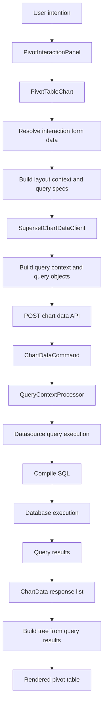
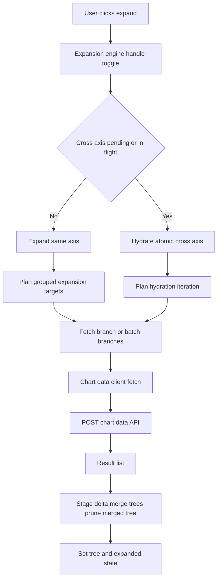

<!--
Licensed to the Apache Software Foundation (ASF) under one
or more contributor license agreements.  See the NOTICE file
distributed with this work for additional information
regarding copyright ownership.  The ASF licenses this file
to you under the Apache License, Version 2.0 (the
"License"); you may not use this file except in compliance
with the License.  You may obtain a copy of the License at

  http://www.apache.org/licenses/LICENSE-2.0

Unless required by applicable law or agreed to in writing,
software distributed under the License is distributed on an
"AS IS" BASIS, WITHOUT WARRANTIES OR CONDITIONS OF ANY
KIND, either express or implied.  See the License for the
specific language governing permissions and limitations
under the License.
-->

# Pivot Table v3 Pipeline Audit

## 1. Scope and Method

This document maps Pivot Table v3 from user intent to SQL execution, using code and tests as primary evidence.

Primary code evidence:

- `src/index.ts`
- `src/buildQuery.ts`
- `src/transformProps.ts`
- `src/PivotTableChart.tsx`
- `src/pivot/layout/LayoutContext.ts`
- `src/pivot/query/specs.ts`
- `src/pivot/query/resolveFetchContext.ts`
- `src/pivot/query/toChartDataQueries.ts`
- `src/pivot/data/SupersetChartDataClient.ts`
- `src/fetchPivotBranch.ts`
- `src/pivot/query/fetchPivotBranchesBatch.ts`
- `src/pivot/expansion/useExpansionEngine.ts`
- `src/pivot/render/renderModel.ts`
- `superset/charts/data/api.py`
- `superset/commands/chart/data/get_data_command.py`
- `superset/common/query_context_processor.py`
- `superset/models/helpers.py`
- `superset/connectors/sqla/models.py`

Primary test evidence:

- `test/plugin/PivotTableChart/interaction-layout.test.tsx`
- `test/plugin/PivotTableChart/interaction-seamless-expansion.test.tsx`
- `test/plugin/pivot/layout/shouldFetchForLayoutChange.test.ts`
- `test/plugin/expand/PivotTableChart.expand.*.test.tsx`
- `test/plugin/PivotTableChart/prefetch.*.test.tsx`
- `test/plugin/gaq/fetches.test.ts`
- `test/plugin/fetchPivotBranch.test.ts`
- `test/plugin/query/fetchPivotBranchesBatch.test.ts`
- `cypress-base/cypress/e2e/explore/visualizations/pivot_table_v3.test.ts`

---

## 2. End-to-End Graph: User Intention -> SQL

SQL generation is concretely compiled in `superset/models/helpers.py:954` and executed in `superset/connectors/sqla/models.py:1618`.

---

## 3. Frontend Pipeline by Stage

## 3.1 Plugin Entrypoint

- Plugin wiring is in `src/index.ts:43-51`.
- Runtime uses:
  - `buildQuery` for Explore/API query context.
  - `transformProps` for initial tree build.
  - `PivotTableChart` for interaction and expansion runtime.

## 3.2 Query Construction (Initial and Reload)

- `src/buildQuery.ts:35-70`: in `user_controlled`, local dimension filters are converted to `QueryObjectFilterClause[]`.
- `src/buildQuery.ts:89-95`: applies interaction layout resolution and builds initial query specs.
- `src/buildQuery.ts:113-120`: writes deterministic `query_name` via `toChartDataQueries`.
- `src/pivot/query/toChartDataQueries.ts:33-45`: each query object carries `query_name`.

## 3.3 Initial Response -> Tree

- `src/transformProps.ts:200`: recomputes initial specs.
- `src/transformProps.ts:384-421`: maps result rows by `query_name` and merges tree chunks.
- `src/transformProps.ts:436-439`: injects measure leaves into tree cells.

## 3.4 Interaction Mode State Split

- `src/PivotTableChart.tsx:1032-1038`: separate committed vs UI state:
  - `committedRuntimeLayout`, `uiRuntimeLayout`
  - `committedFilters`, `uiSelectedFilters`
  - `committedTree`
- `src/PivotTableChart.tsx:1305-1403`: `applySeamlessUpdate` performs stale-while-revalidate table updates.
- `src/PivotTableChart.tsx:1421-1453`: `handleRuntimeLayoutChange` decides whether to fetch or just persist.
- `src/PivotTableChart.tsx:1768-1793`: filter changes call seamless update immediately.

## 3.5 Expansion Fetch Pipeline

Key evidence:

- Engine core: `src/pivot/expansion/useExpansionEngine.ts`
- Same-axis loop: `src/pivot/expansion/useExpansionEngine.ts:824-1260`
- Atomic hydration: `src/pivot/expansion/useExpansionEngine.ts:1335-1695`
- Toggle routing: `src/pivot/expansion/useExpansionEngine.ts:1697-1754`

## 3.6 Query Planning Internals

- Layout normalization and metric placeholder handling:
  - `src/pivot/layout/resolveInteractionLayout.ts:80-198`
  - `src/pivot/layout/LayoutContext.ts:114-262`
- Initial specs and prefetch:
  - `src/pivot/query/specs.ts:485-796`
- Branch context and depth computation:
  - `src/pivot/query/resolveFetchContext.ts:85-335`
- Branch request path:
  - `src/fetchPivotBranch.ts:306-423`
  - `src/pivot/query/fetchPivotBranchesBatch.ts:64-154`

## 3.7 Transport and API Behavior

- Client request bundling and retries:
  - `src/pivot/data/SupersetChartDataClient.ts:162-263`
- Global async query (202) handling:
  - `src/pivot/data/SupersetChartDataClient.ts:58-84`
- Split/retry on 413:
  - `src/pivot/data/SupersetChartDataClient.ts:213-234`

---

## 4. Backend SQL Chain

- API endpoint parses chart query context and runs command:
  - `superset/charts/data/api.py:180-262`
- Command delegates to query context:
  - `superset/commands/chart/data/get_data_command.py:40-70`
- Query context executes each query object:
  - `superset/common/query_context_processor.py:1053-1070`
- Query object reaches datasource query:
  - `superset/common/query_context_processor.py:268-281`
- SQL compilation:
  - `superset/models/helpers.py:954-977`
- SQL execution:
  - `superset/connectors/sqla/models.py:1618-1657`

---

## 5. Verified Strengths

- Query-name based result matching is explicitly implemented in multiple paths:
  - `src/transformProps.ts:384-405`
  - `src/PivotTableChart.tsx:119-129`
  - `src/fetchPivotBranch.ts:379-397`
- Cross-axis atomic hydration behavior is covered by focused tests:
  - `test/plugin/expand/PivotTableChart.expand.cross-axis.no-blanks.test.tsx`
  - `test/plugin/expand/PivotTableChart.expand.cross-axis.concurrent.test.tsx`
- Persisted expansion, epoch invalidation, and concurrent merge have dedicated tests:
  - `test/plugin/PivotTableChart/prefetch.epoch.test.tsx`
  - `test/plugin/PivotTableChart/prefetch.concurrent-merge.test.tsx`
  - `test/plugin/PivotTableChart/prefetch.satisfied-targets.test.tsx`

---

## 6. Inconsistencies and Architectural Improvements

## 6.1 Duplicate Query Planning Implementations (High)

Evidence:

- `src/pivot/query/specs.ts` is actively used by `buildQuery`, `transformProps`, and `applySeamlessUpdate`.
- `src/pivot/engine/initialQueryPlan.ts` implements similar logic but appears unused in runtime.
- The two implementations already drift:
  - `specs.ts` root prefetch gate uses base depth (`baseRowDepth/baseColDepth`).
  - `initialQueryPlan.ts` gate uses visible depth (`visibleRowDepth/visibleColDepth`).

Impact:

- Behavioral drift risk.
- Harder debugging and documentation mismatch.

Improvement:

- Consolidate on one planner module and delete the dead path, or hard-link one to the other.

## 6.2 Fetch Decision Is Layout-Only, Not Data-Coverage-Aware (High)

Evidence:

- `src/pivot/layout/shouldFetchForLayoutChange.ts:37-63` only compares layout signatures.
- It always fetches for row/column reorder and most layout mutations.
- Tests enforce this broad behavior: `test/plugin/pivot/layout/shouldFetchForLayoutChange.test.ts`.

Impact:

- Over-fetching and more race windows.
- Increased chance of transient stale/deep expansion inconsistencies after rapid interactions.

Improvement:

- Replace with tree-coverage-aware decision:
  - required target depth versus already fetched depth.
  - existing branch availability.
  - no-fetch paths for pure presentation-only changes.

## 6.3 Seamless Update Replaces Entire Committed Tree (High)

Evidence:

- `src/PivotTableChart.tsx:1373-1381` builds a fresh tree and calls `setCommittedTree(nextTree)`.

Impact:

- Deep branches from previous interactions can disappear unless immediately rehydrated.
- User symptom match: nodes appear not updated or not expandable deep after layout/filter mutation.

Improvement:

- Preserve prior expansion intent and explicitly rehydrate to target state as part of seamless completion.
- Optionally merge-compatible branches instead of full replace where safe.

## 6.4 Branch Cache Has No Data Epoch Invalidation (High)

Evidence:

- Global in-memory cache in `src/pivot/data/cache.ts:37-67`.
- Cache key includes filters/layout/metrics but no source-data version/timestamp.
- No runtime `clearPivotBranchCache()` call in plugin code path.

Impact:

- Stale branch reuse after base dataset changes without filter/layout changes.
- Possible "nodes not updating" behavior.

Improvement:

- Add cache epoch/data signature to keys (for example from form data or chart refresh token), or clear cache on committed base refresh and seamless commits.

## 6.5 Hydration Loop Hard Limit Can Silently Cap Deep Recovery (Medium)

Evidence:

- `MAX_HYDRATION_ITERATIONS = 12` in `src/pivot/expansion/useExpansionEngine.ts:78`.
- Both same-axis and atomic hydration loops are bounded.

Impact:

- Large/deep expansion plans can stop before full convergence with no explicit diagnostic.

Improvement:

- Track remaining pending targets; if capped, emit warning/error telemetry and continue in chunks.

## 6.6 Known Functional Debt Captured by Test (Medium)

Evidence:

- `test/plugin/PivotTableChart/totals/columns.test.tsx:2104` has explicit duplication scenario:
  - "currently renders both parent total and subtotal leaves ... (duplication)".

Impact:

- Confusing totals rendering and potential row/column count drift.

Improvement:

- Normalize subtotal node model and prevent duplicate subtotal leaf generation at render stage.

## 6.7 Styling/Component Modernization Drift (Low)

Evidence:

- Direct icon import from `@ant-design/icons` in `src/pivot/render/PivotTableView.tsx:27-31`.

Improvement:

- Align to project modernization guidance where possible.

---

## 7. Testing Coverage Today

Strong coverage exists for:

- Expansion engine core behavior and race cases:
  - `test/plugin/PivotTableChart/expansion-state.test.tsx`
  - `test/plugin/expand/PivotTableChart.expand.concurrent.test.tsx`
  - `test/plugin/expand/PivotTableChart.expand.cross-axis.*.test.tsx`
- Query planning and contracts:
  - `test/plugin/buildQuery.test.ts`
  - `test/plugin/contracts/*.test.ts`
  - `test/plugin/query/*.test.ts`
- Interaction layout and selected seamless paths:
  - `test/plugin/PivotTableChart/interaction-layout.test.tsx`
  - `test/plugin/PivotTableChart/interaction-seamless-expansion.test.tsx`

Major gap:

- E2E coverage for interaction mode is effectively absent in committed Cypress tests.
  - Current E2E (`cypress/e2e/.../pivot_table_v3.test.ts`) focuses on temporal expansion formatting and branch request presence.

---

## 8. Testing Gaps for Seamless Reload in Interaction Mode

This is the critical section for your current bug reports.

## P0 Gaps (Highest Risk)

1. Stale seamless response ordering is not directly tested.
- Missing scenario: two rapid layout/filter changes, second request returns first, first returns last.
- Expected: only latest request mutates tree/layout/filters.
- Evidence path: request id guard in `src/PivotTableChart.tsx:1359-1371` and `1385-1401` has no dedicated test.

2. Abort/cancel behavior of seamless requests is not tested.
- Missing scenario: new seamless update cancels old (`cancel(SEAMLESS_REQUEST_GROUP)`), old throws AbortError.
- Expected: no user-facing error, no stale commit.
- Evidence path: `src/PivotTableChart.tsx:1361`, `1388-1394`.

3. Seamless error retention/recovery is not tested.
- Missing scenario: seamless fetch fails, old table remains, then next successful update clears error and commits new data.
- Evidence path: `src/PivotTableChart.tsx:1384-1397`.

4. Deep hierarchy continuity after seamless update is under-tested.
- Existing interaction seamless tests mostly validate shallow transitions.
- Missing scenario: row depth >=4 and col depth >=3 with multiple expanded branches, then layout/filter seamless update.
- Expected: previously expanded paths either preserved or deterministically rehydrated without blank intersections.

5. Cross-axis expansion in-flight + seamless reload interaction is not tested.
- Missing scenario: `hydrateAtomic('cross-axis')` running while user changes layout/filter (seamless path).
- Expected: canceled/stale work is ignored; final state deterministic.

## P1 Gaps (Important)

6. Filter-driven seamless reload has no integration tests in `PivotTableChart`.
- Missing:
  - selecting dimension filter triggers seamless fetch with correct `extra_form_data.filters`.
  - clearing filters removes local filters and reloads.
  - persisted `pivotSelectedFilters` behavior with `setControlValue`.
- Evidence path:
  - `src/PivotTableChart.tsx:1768-1793`
  - `src/buildQuery.ts:35-87`

7. Dimension value lookup workflow is untested.
- Missing:
  - `handleFetchDimensionValues` excludes active dimension from self-filter.
  - request version guard drops stale option payload.
  - loading indicators clear correctly.
- Evidence path: `src/PivotTableChart.tsx:1684-1758`.

8. Seamless multi-query result order robustness lacks explicit test.
- `buildTreeFromQueryResults` matches by `query_name`, but no dedicated interaction seamless test asserts out-of-order result arrays.
- Evidence path: `src/PivotTableChart.tsx:106-145`.

9. Truncation warning UX for seamless path is not tested.
- Warning collection exists (`collectWarnings`) but no test validates warning surfacing in interaction mode.

10. Cache invalidation across base refresh is untested.
- Missing scenario: refresh base data with same layout/filters and verify branch cache does not replay stale branches.

## P2 Gaps (Useful but Lower Priority)

11. No stress test for hydration iteration cap (`MAX_HYDRATION_ITERATIONS`).
- Missing scenario: enough pending expansions to require >12 iterations.
- Expected: either complete or fail loudly with diagnostic.

12. No E2E tests for interaction-mode seamless behavior.
- Missing user-flow tests:
  - rapid chip reorder + filter change + expand.
  - deep row and column expansion after seamless layout update.
  - stale-response race under artificial network delay.

---

## 9. Suggested Test Additions (Concrete)

Recommended new test files:

- `test/plugin/PivotTableChart/interaction-seamless-race.test.tsx`
  - stale ordering
  - abort behavior
  - failure then recovery
- `test/plugin/PivotTableChart/interaction-seamless-filters.test.tsx`
  - filter apply/clear request payload
  - selected filter persistence
  - dimension values lookup lifecycle
- `test/plugin/PivotTableChart/interaction-seamless-deep-hierarchy.test.tsx`
  - deep row+col expansions preserved/rehydrated after seamless update
  - cross-axis in-flight + seamless mutation
- `cypress/e2e/explore/visualizations/pivot_table_v3_interaction_mode.test.ts`
  - end-to-end user-controlled flows with delayed network responses

Acceptance criteria for "robust chart":

- No stale data commit under rapid interaction.
- No lost deep expansions after seamless updates.
- No blank intersection cells when cross-axis expansion and seamless reload interleave.
- Filter changes are reflected in query payload and persisted state consistently.
- Branch cache never serves stale data across base refresh boundaries.

---

## 10. Final Assessment

Pivot v3 has strong foundational pieces (deterministic query naming, explicit expansion model, atomic cross-axis hydration), but current interaction-mode seamless reload coverage is not sufficient for deep hierarchy/race-heavy workflows.

Your reported failures ("nodes not expanding deep", "nodes not updating") are consistent with the specific untested boundaries above, especially:

- seamless request race/cancel edges,
- full-tree replacement during seamless commits,
- cache invalidation across refreshes,
- deep hydration cap and interleaving flows.

Closing the P0/P1 gaps should materially improve stability and confidence.
